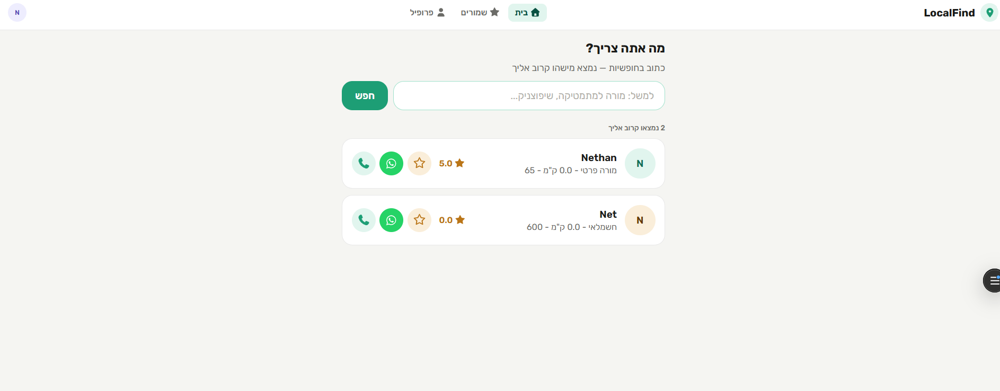
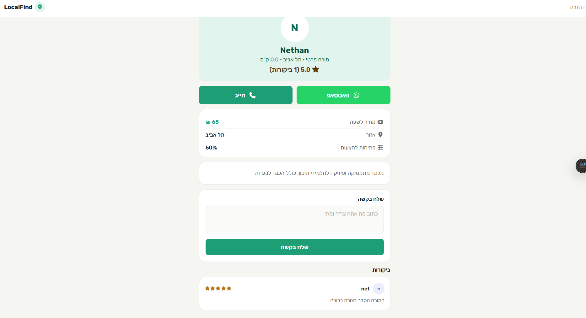
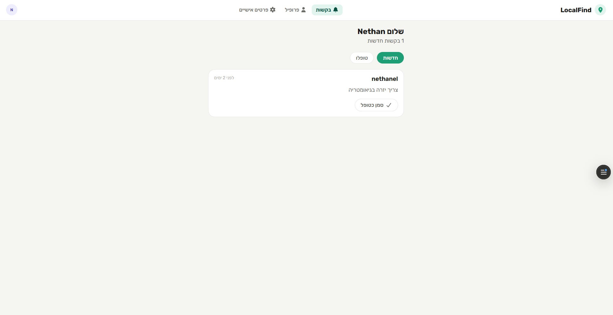
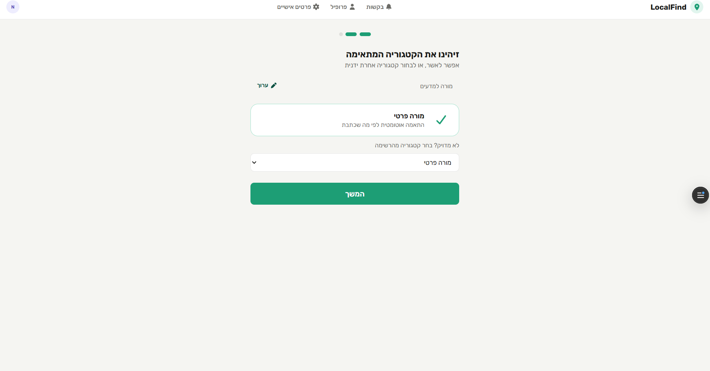
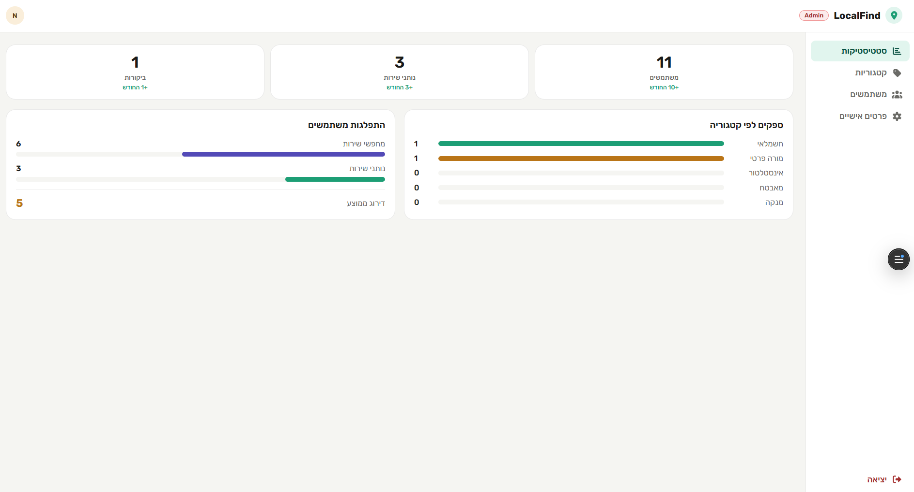
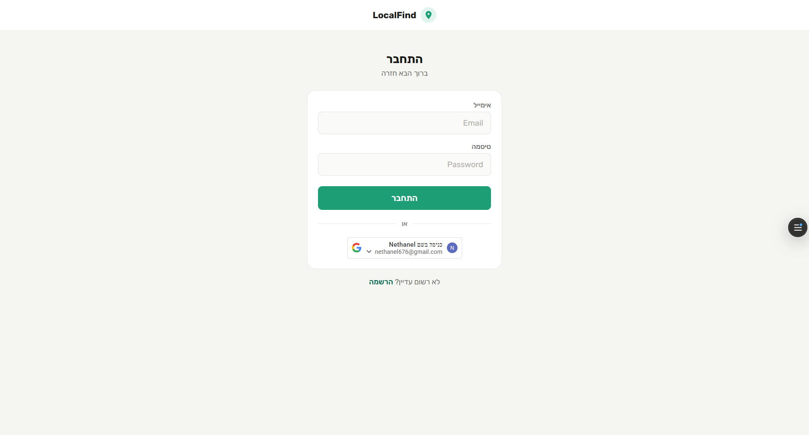

# LocalFind - Frontend

React client for LocalFind, a location based marketplace that connects people looking for a local service with providers who offer it. A seeker describes what they need in free text, the app matches it to a service category and shows nearby providers sorted by distance, and contact happens directly over WhatsApp or a phone call. This repository holds only the client. It talks to the LocalFind API, which lives in a separate repository at https://github.com/nethanel24/localfind-backend.

## Team members and roles

This project was built solo by Nethanel (GitHub: [nethanel24](https://github.com/nethanel24)), responsible for the entire stack: the Node/Express/MongoDB API, the database design, this React client, and the cloud deployment of both parts.

## Live deployment

The application is live and fully functional with no local setup required.

Frontend on Vercel: https://localfind-frontend.vercel.app
Backend API on Render: https://localfind-backend.onrender.com

The backend runs on a free tier that sleeps after about fifteen minutes of inactivity, so the very first request after an idle period can take close to a minute to wake the server before pages start loading normally.

## Tech stack

The client is a single page application built with React and TypeScript on top of Vite. Routing is handled by React Router, and all data flows through an Axios service layer. Global state is split on purpose between two tools. The React Context API holds the authentication session, since that is a simple value that most of the app needs to read, and Redux Toolkit holds the heavier feature state, namely the provider feed and the favorites list, where async requests and derived data justify a proper store. Styling uses Vite's built in CSS Modules per component over a single set of design tokens declared once in `index.css`, and the whole layout is right to left and Hebrew first. Icons come from Font Awesome, and Google sign in uses the official Google OAuth library.

## Screenshots

Screenshots of the main screens live in `docs/screenshots`. These cover the core journeys for all three roles: a seeker searching and contacting a provider, a provider onboarding and handling requests, and an admin viewing statistics.








## Project structure

The `src` folder is organized by responsibility rather than by screen, so shared building blocks stay separate from the pages that use them.

```
src/
  main.tsx                  App entry, mounts the Redux Provider and the Router
  App.tsx                   Route table with React.lazy + Suspense on every page
  index.css                 Global design tokens and base RTL styles
  services/
    api.ts                  Axios instance, JWT request interceptor, global 401 handler
  context/
    AuthContext.tsx         Auth session: current user, login, logout, refreshUser
  store/
    store.ts                Redux Toolkit store
    hooks.ts                Typed useAppDispatch / useAppSelector
    slices/
      providersSlice.ts     Feed data and AI search results
      favoritesSlice.ts     Saved providers, kept as full items plus an id set
  hooks/
    useFetch.ts             Reusable typed fetch hook for the non Redux screens
    useGeolocation.ts       Reads the browser location as GeoJSON [lng, lat]
  components/
    common/                 ProtectedRoute, LoadingSpinner, ErrorMessage
    layout/                 Navbar and AdminLayout
    ProviderCard/           Memoized card used across the feed and favorites
  pages/                    One folder per screen, each with its own .module.css
  utils/                    distance, phone (wa.me), timeAgo, categoryIcon
  types/                    Shared TypeScript types
```

## Running locally

1. Clone the repository and move into it.
2. Run `npm install` to pull the dependencies.
3. Create a `.env` file in the project root by copying `.env.example`, then fill in the two values described below.
4. Run `npm run dev` and open the URL that Vite prints, by default http://localhost:5173.

The client expects the API to be reachable at the address in `VITE_API_URL`. For local development that usually means running the backend from its own repository on port 5000 and pointing this variable at it.

## Environment variables

Both variables are read at build time by Vite, which is why they carry the `VITE_` prefix. Nothing secret lives here, since the client only needs to know where the API is and which Google client to use for sign in. A `.env.example` with placeholder values is committed to the repository, while the real `.env` is git ignored.

| Variable | Purpose |
| --- | --- |
| `VITE_API_URL` | Base URL of the LocalFind API, including the `/api` path. Locally this is `http://localhost:5000/api`, and in production it is the Render address. |
| `VITE_GOOGLE_CLIENT_ID` | OAuth client id from Google Cloud Console, used by the Google sign in button on the register and login screens. |

## Building and deploying

Running `npm run build` type checks the project and produces a static bundle in `dist`. That output is what gets served in production. Deployment goes to Vercel, which runs the same build command and serves the `dist` folder. A `vercel.json` file adds a rewrite so that every path falls back to `index.html`, which is what lets a single page application handle its own client side routes without returning a 404 on refresh. The two environment variables above are set in the Vercel project settings rather than committed to the repository. On the API side, the deployed frontend origin has to be allowed by the backend's CORS configuration and added to the authorized origins of the Google OAuth client for live sign in to work.
